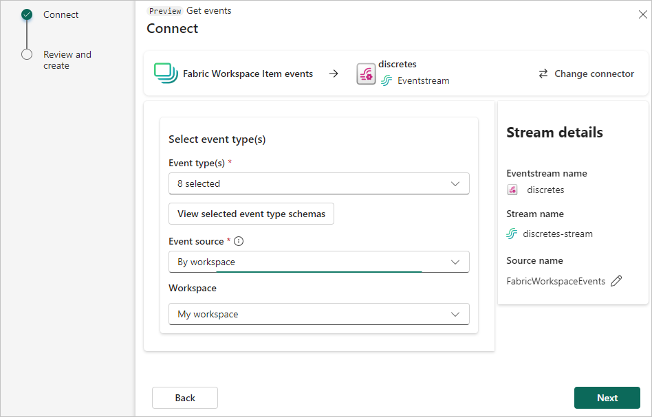

1. On the **Select a data source** screen, select **Fabric Workspace Item events**.

   

1. On the **Connect** screen, select the **Workspace** and specific **Event type** you want to capture in the eventstream. By default, all supported events are captured.

   

1. Select **Next**.

1. On the **Review and create** screen, select **Add** to complete the configuration for Fabric workspace item events.

