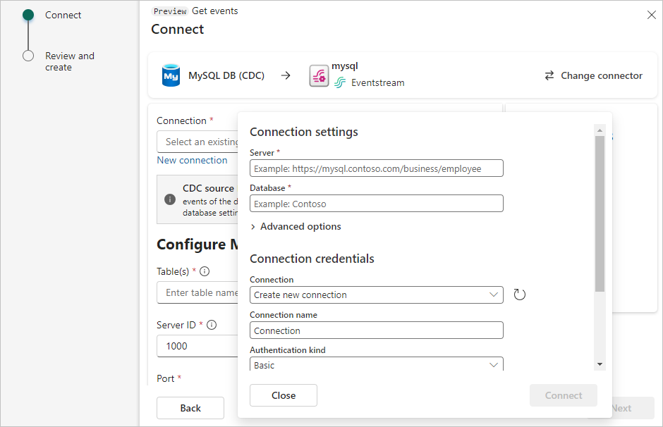
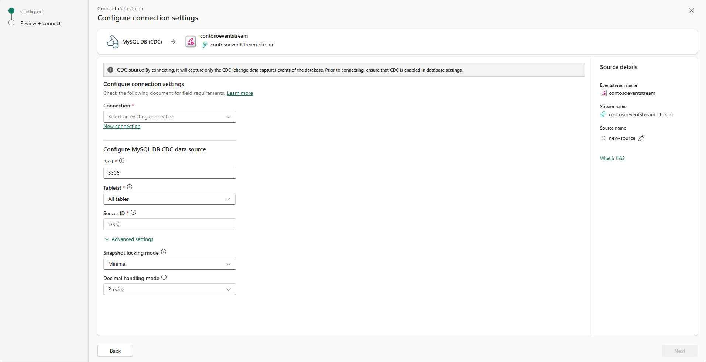

1. On the **Select a data source** screen, select **Azure MySQL DB (CDC)** as the data source.

   

1. On the **Connect** screen, under **Connection**, select **New connection** to create a cloud connection.

1. Enter the following **Connection settings** and **Connection credentials** for your Azure MySQL DB, and then select **Connect**.

   - **Server:** The server address of your Azure Database for MySQL database, for example *my-mysql-server.mysql.database.azure.com*.
   - **Database:** The database name, for example *my_database*.
   - **Connection name**: Automatically generated, or you can enter a new name for this connection.
   - **Username** and **Password**: Enter the credentials for your Azure Database for MySQL database. Make sure you enter the **Server admin login name.**

   

1. Enter the following information to configure the Azure MySQL DB CDC data source, and then select **Next**.

   - **Table(s)**: Enter a list of table names separated by commas. Each table name must follow the format `<database name>.<table name>`, for example *my_database.users*.
   - **Server ID**: Enter a unique value for each server and replication client in the MySQL cluster. The default value is 1000.
   - **Port**: Leave the default value unchanged.

   

   > [!NOTE]
   > **Set a different Server ID for each reader**. Every MySQL database client for reading binlog should have a unique id, called Server ID. MySQL Server uses this ID to maintain the network connection and the binlog position. Different jobs sharing the same Server ID can result in reading from the wrong binlog position. Therefore, it's recommended to set a different Server ID for each reader.

1. After reviewing the summary for Azure MySQL DB CDC source, select **Add** to complete the configuration.
