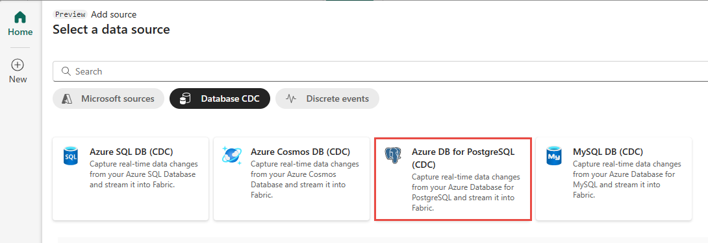
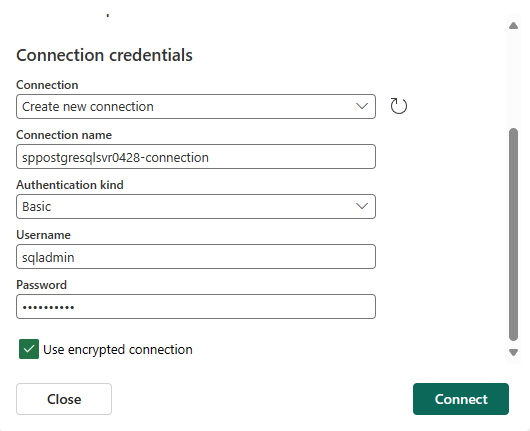

1. On the **Select a data source** screen, select **Azure DB for PostgreSQL (CDC)**.

   

1. On the **Connect** screen, enter the **Connection settings** and **Connection credentials** for your PostgreSQL database.

   

   - **Server**: The server address of your PostgreSQL database, for example *my-pgsql-server.postgres.database.azure.com*.
   - **Database**: The database name, for example *my_database*.
   - **Connection name**: Automatically generated, or you can enter a new name.
   - **Username** and **Password**: Enter the user name and password for your PostgreSQL database. Make sure to use the server admin login name.
   - **Table(s)**: Enter a table name or leave it as **All tables**.

1. Select **Connect**.

1. Select **Next**. On the **Review and create** screen, review the summary, and then select **Add**.

