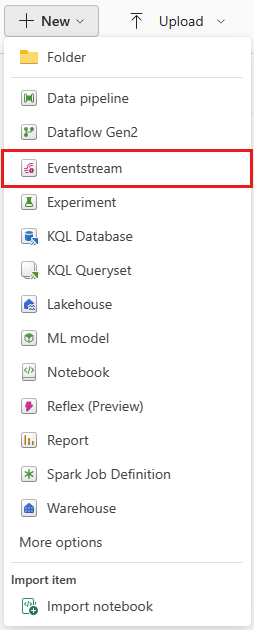
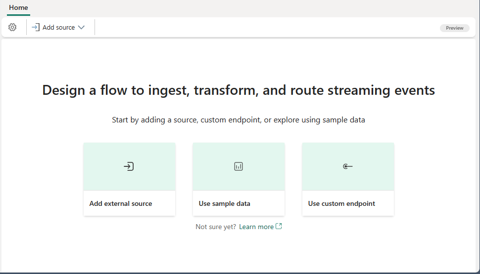

# Stream and consume events to and from Real-Time Intelligence using Apache Kafka endpoint in Eventstream

In this tutorial, you learn how to use the Apache Kafka endpoint provided by Eventstream’s Custom endpoint (also known as Custom App in a standard Eventstream) source to stream the streaming events to Real-Time Intelligence. Additionally, you'll learn how to consume these streaming events using the Apache Kafka endpoint from Eventstream’s Custom endpoint destination.

## Prerequisites
To complete this tutorial, make sure you have the following prerequisites:

- Get access to a premium workspace with Contributor or higher permissions where your eventstream is located.
- Get a Windows machine and install the following components:
  - [Java Development Kit (JDK) 1.7+](/azure/developer/java/fundamentals/java-support-on-azure).
  - [Download](https://maven.apache.org/download.cgi) and [install](https://maven.apache.org/install.html) a Maven binary archive.
  - [Git](https://www.git-scm.com/).

## Create an eventstream in Microsoft Fabric
You can create an eventstream from the **Workspace page** or the **Create hub** page. Follow these steps to create an eventstream:

1. Change your Fabric experience to **Real-Time Intelligence**.
1. Follow one of these steps to start creating an eventstreams:

   - On the **Real-Time Intelligence** homepage, select the **Eventstream** tile:

      :::image type="content" source="./media/create-manage-an-eventstream/eventstream-creation-homepage.png" alt-text="Screenshot showing the eventstream tile on the homepage.":::

   - On the **Workspace** page, select **New** and then **Eventstream**:
  
      

   - On the **Create hub** page, select the **Eventstream** tile:
  
      

2. Enter a **name** for the new eventstream and select **Enhanced Capabilities (preview)** checkbox, and then select **Create**. 

    
   

3. Creation of the new eventstream in your workspace can take a few seconds. After the eventstream is created, you're directed to the homepage where you can start with adding sources to the eventstream.

    

## Retrieve the Kafka endpoint from an added custom endpoint source
To get a Kafka topic endpoint, simply add a custom endpoint source to your eventstream. Once added, the Kafka connection endpoint is readily available and exposed within the custom endpoint source.

Follow these steps to add a custom endpoint source to your eventstream:

1. Select **Use custom endpoint** on your eventstream homepage if it's an empty eventstream,  
   
   

   Or select **Add source** on the ribbon and then select **Custom endpoint**. The custom endpoint configuration dialog appears.
   
   

2. Enter a **Source name** value for the custom endpoint, and then select **Add**. The source name appears on the source node on your eventstream’s canvas. Check it in the following step.
   
   
   
3. After you add the custom endpoint source, you see it on the canvas in **Edit mode**.

   
   
4. To see the Kafka endpoint details, select **Publish**. Once it's published successfully, you can retrieve the Kafka endpoint details (**Keys** and **sample code**, refer to [Kafka endpoint details](./add-source-custom-app.md?pivots=enhanced-capabilities#kafka)) by selecting the **Kafka** tab in the bottom pane of the custom endpoint source node.

    From the **Keys** page, you can obtain the important Kafka endpoint information:

   - `bootstrap.servers={YOUR.BOOTSTRAP.SERVER}`
   - `security.protocol=SASL_SSL`
   - `sasl.mechanism=PLAIN`
   - `sasl.jaas.config=org.apache.kafka.common.security.plain.PlainLoginModule required username="$ConnectionString" password="{YOUR.CONNECTION.STRING}";`

    The `{YOUR.BOOTSTRAP.SERVER}` is the **Bootstrap server** and the `{YOUR.CONNECTION.STRING}` can be either the **Connection string-primary key** or the **Connection string-secondary key** shown in the **Keys** page.  Choose one to use.

   

## Send events with Kafka application

With the important Kafka information obtained from the above step, you'll be able to use it to replace the connection configurations in your existing Kafka application. Then you can send the events to your eventstream. 

Here's one application based on event hub SDK written in JAVA by following the Kafka protocol. To use this application to stream events to your eventstream, just follow the following steps to replace the Kafka endpoint information and execute it properly:

1. Clone the [Azure Event Hubs for Kafka repository](https://github.com/Azure/azure-event-hubs-for-kafka).
1. Navigate to azure-event-hubs-for-kafka/quickstart/java/producer
1. Update the configuration details for the producer in src/main/resources/producer.config as follows:

   - `bootstrap.servers={YOUR.BOOTSTRAP.SERVER}`
   - `security.protocol=SASL_SSL`
   - `sasl.mechanism=PLAIN`
   - `sasl.jaas.config=org.apache.kafka.common.security.plain.PlainLoginModule required username="$ConnectionString" password="{YOUR.CONNECTION.STRING}";`
  
    Replace `{YOUR.BOOTSTRAP.SERVER}` with **Bootstrap server**.
    The `{YOUR.CONNECTION.STRING}` can be either the **Connection string-primary key** or the **Connection string-secondary key**. Choose one to use.

   

1. Update the topic name with the new topic name in the Keys page in `src/main/java/TestProducer.java` as follows:
   - `private final static String TOPIC = "{YOUR.TOPIC.NAME}";` 
You can find the `{YOUR.TOPIC.NAME}` on the Key page under the Kafka tab as shown in the screenshot below.

        

1. Run the producer code and stream events into the eventstream:
   - `mvn clean package`
   - `mvn exec:java -Dexec.mainClass="TestProducer"`
  
     

Select the eventstream node, which is the middle node displaying your eventstream name, to preview the data which were sent with this Kafka application.  Selecting the data format ‘CSV with delimiter comma without header’ since this matches the format in which the application has streamed the events data. 

## Obtain the Kafka endpoint from an added custom endpoint destination

Similarly, you can add a custom endpoint destination to obtain the Kafka connection endpoint details for consuming events from your eventstream. Once it's added successfully, you can obtain the information from the **Details** pane of this destination in live view.

From the **Basic** page, you can get the **Consumer group** which is needed to configure the Kafka consumer application later.

From the **Keys** page, you can obtain the important Kafka endpoint information:

- `bootstrap.servers={YOUR.BOOTSTRAP.SERVER}`
- `security.protocol=SASL_SSL`
- `sasl.mechanism=PLAIN`
- `sasl.jaas.config=org.apache.kafka.common.security.plain.PlainLoginModule required username="$ConnectionString" password="{YOUR.CONNECTION.STRING}";`

The `{YOUR.BOOTSTRAP.SERVER}` is the **Bootstrap server** and
`YOUR.CONNECTION.STRING` can be either the **Connection string-primary key** or the **Connection string-secondary key** shown in the **Keys** page. Choose one to use.

## Consume events with Kafka application

Now you can use another application in [Azure Event Hubs for Kafka repository](https://github.com/Azure/azure-event-hubs-for-kafka) to consume the events from your eventstream. To utilize this application for consuming events from your eventstream, simply follow these steps to replace the Kafka endpoint details and run it appropriately:

1. Clone the [Azure Event Hubs for Kafka repository](https://github.com/Azure/azure-event-hubs-for-kafka).
1. Navigate to *azure-event-hubs-for-kafka/quickstart/java/consumer*.
1. Update the configuration details for the consumer in *src/main/resources/consumer.config* as follows:
   - `bootstrap.servers={YOUR.BOOTSTRAP.SERVER}`
   - `group.id={YOUR.EVENTHUBS.CONSUMER.GROUP}`
   - `security.protocol=SASL_SSL`
   - `sasl.mechanism=PLAIN`
   - `sasl.jaas.config=org.apache.kafka.common.security.plain.PlainLoginModule required username="$ConnectionString"`
   - `password="{YOUR.CONNECTION.STRING}";`

   Replace `{YOUR.BOOTSTRAP.SERVER}` with **Bootstrap server**. The `YOUR.EVENTHUBS.CONSUMER.GROUP` can be got from the **Basic** page in the **Details** pane fo the custom endpoint destination. The `YOUR.CONNECTION.STRING` can be either the **Connection string-primary key** or the **Connection string-secondary key**. Choose one to use.

1. Update the topic name with the new topic name in the Keys page in **Keys** page in *src/main/java/TestConsumer.java* as follows:
   - `private final static String TOPIC = "{YOUR.TOPIC.NAME}";`
You can find the `{YOUR.TOPIC.NAME}` on the Key page under the Kafka tab as shown in the screenshot below.

        

1. Run the consumer code and stream events into eventstream:
   - `mvn clean package`
   - `mvn exec:java -Dexec.mainClass="TestConsumer"`

If your eventstream has incoming events (for example, your previous producer application is still running), you should see the consumer now is receiving events from your eventstream topic (the topic you used above) as shown below.

 

By default, Kafka consumers read from the end of the stream rather than the beginning. This means any events queued before you begin running your consumer won't be read. If you start your consumer but it isn't receiving any events, try running your producer again while your consumer is polling.

## Conclusion
Congratulations! You’ve successfully learned how to use the Kafka endpoint exposed from your eventstream to stream and consume the events with your eventstream. If you already have an application that is sending or consuming from a Kafka topic, you can simply use the same application to send or consume the events within your eventstream without any code changes by just changing the connection configuration information.
