# What is Real-Time Dashboard?

Real-Time Dashboard is Microsoft Fabric's solution for live monitoring and visualization. It helps you turn streaming data into actionable insights quickly, so you can monitor operational signals, spot changes as they happen, and respond without delay. Designed for operations managers, data analysts, and business users, Real-Time Dashboard enables users to monitor, analyze, and act on live data streams through interactive, continuously updating visualizations that surface insights and anomalies as they happen.

This overview explains what Real-Time Dashboard is, what it's used for, and the capabilities that make it useful for real-time decision-making.

:::image type="content" source="media/tutorial/final-dashboard.png" alt-text="Screenshot of a real-time dashboard in Fabric displaying sample bike data." lightbox="media/tutorial/final-dashboard.png":::

You can also embed a Real-Time Dashboard in your own web application by using Fabric Embedded. This approach lets users interact with live data directly within your application, while Microsoft Fabric continues to enforce authentication and permissions. For more information, see [Fabric Embedded](../embed/what-is-fabric-embed.md).

## Key features

* **Live data monitoring:** Real-Time Dashboard supports optional [live refresh](dashboard-live-refresh.md), so dashboards automatically update as new data is ingested or at configured intervals. Alternatively, you can keep dashboards static and trigger updates manually. This feature enables timely visibility into changing conditions, trends, and anomalies.

* **Interactive exploration:** Dashboards support analysis directly within visuals, so you can:
    * Slice and dice by time or other custom dimensions to focus on key metrics.
    * Apply [filters](dashboard-parameters.md#interact-with-your-data-by-using-cross-filter) or [drill down](dashboard-parameters.md#use-drillthroughs-as-dashboard-parameters) on chart elements to refine other visuals or dive deeper into the data.

    These capabilities let you explore and refine insights without leaving the dashboard experience.

* **Copilot-powered authoring and exploration:** Real-Time Dashboard leverages Copilot to streamline both dashboard creation and data analysis through natural language interactions.
    * Users can [generate dashboards](copilot-generate-dashboard.md) from a selected data source, [create and refine KQL queries](copilot-writing-queries.md) directly within the tile editor, and [explore and analyze data](dashboard-explore-data.md) to uncover insights - all without requiring deep technical expertise.
    * This feature enables both business users and advanced analysts to efficiently build, customize, and interact with real-time dashboards.

* **Proactive monitoring and automation:** Real-Time Dashboard integrates with Data Activator to support event-driven workflows, so you can:
    * Define thresholds for key metrics.
    * [Trigger alerts](data-activator/activator-get-data-real-time-dashboard.md) when conditions are met.
    * Initiate automated actions such as notifications or workflows. 

    This feature helps you move from passive monitoring to proactive management and response, so critical events are addressed promptly.

* **Version control and lifecycle management:** Integrate dashboards with Git-based workflows so you can:
    * Sync dashboards with [GitHub or Azure DevOps](git-real-time-dashboard.md) for version control and collaborative development.
    * Track changes and manage dashboard versions effectively.
    * Collaborate with team members while maintaining a clear history of modifications.

* **Data sharing and collaboration:** Use [safe collaboration](dashboard-permissions.md) to [share dashboards](dashboard-real-time-create.md#share-the-dashboard) securely without exposing the underlying data. This feature gives more people visibility while preserving data security and governance.

## Supported data sources

Real-Time Dashboard integrates with several data sources so you can monitor and visualize real-time data from multiple platforms. Supported sources include:

* **[Eventhouse](dashboard-real-time-create.md#add-data-source):** Ingest and process real-time event data efficiently.
* **[Azure Data Explorer](dashboard-real-time-create.md#add-data-source):** Query and analyze large volumes of log and telemetry data in real time.
* **[Azure Monitor - Application Insights](dashboard-real-time-create.md#add-data-source):** Monitor live application performance, identify bottlenecks, and diagnose issues.
* **[Azure Monitor - Log Analytics](dashboard-real-time-create.md#add-data-source):** Query and analyze log data from Azure resources to surface operational insights.

By connecting to these data sources, you can use streaming data to drive timely and informed decisions.

## Supported visuals

Real-Time Dashboard supports most visualizations available through the [render operator](/kusto/query/render-operator?context=/fabric/context/context-rta&pivots=fabric), as well as the following [dashboard-specific visuals](dashboard-visuals.md): funnel chart, and heatmap.

The following table describes each supported visual, along with common use cases and a visual example. For more information on customizing the properties of each visual type, see [Customize Real-Time Dashboard visuals](dashboard-visuals-customize.md).

| Visual | Description | Use case | Visual example |
|--|--|--|--|
| **Anomaly chart** | A time chart that automatically highlights data points identified as anomalies. | Spot unexpected spikes or drops in a metric over time, such as unusual error rates. | 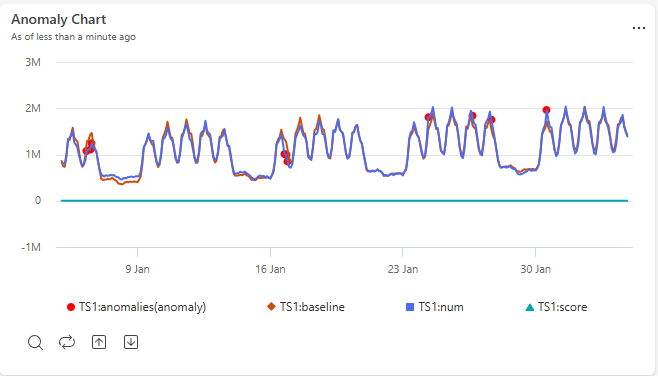 |
| **Area chart** | A line chart with the area beneath each line filled in, showing values accumulating over time. | Show trends in volume or magnitude over time, such as total requests processed per hour. | 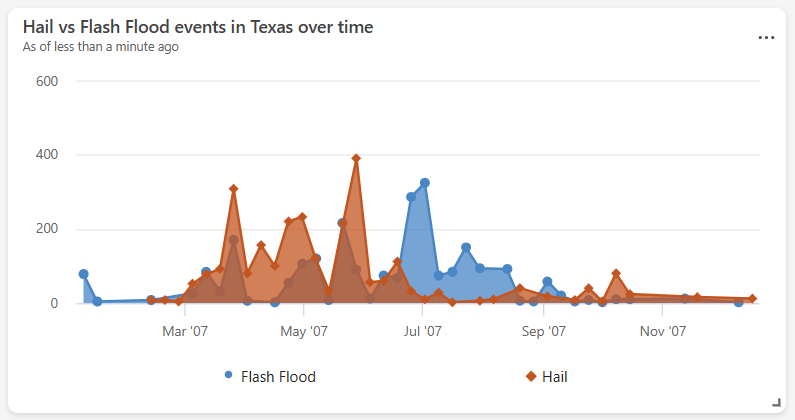 |
| **Bar chart** | A chart that represents categories as horizontal bars, with length proportional to value. | Compare values across categories with long or many labels, such as errors by service name. | 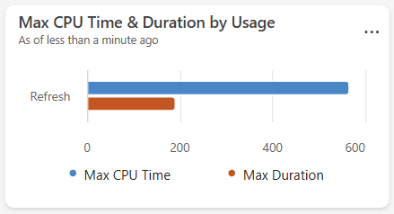 |
| **Column chart** | A chart that represents categories as vertical bars, with height proportional to value. | Compare values across categories or discrete time buckets, such as daily sign-ups. | 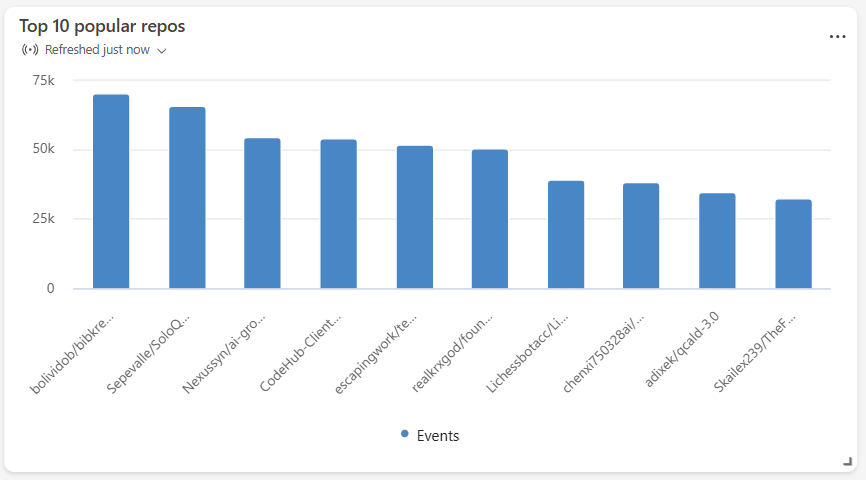 |
| **Funnel chart** | A chart that shows values decreasing through sequential stages, shaped like a funnel. | Track drop-off through a multistep process, such as conversions through a sign-up flow. | 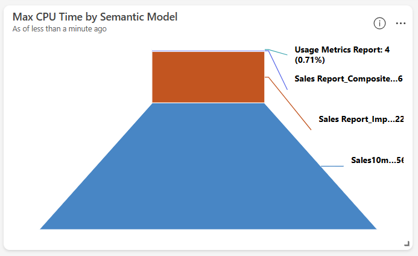 |
| **Heatmap** | A grid that uses color intensity to represent the magnitude of a value across two dimensions. | Identify patterns or concentrations across two categories, such as activity by hour and day of week. | 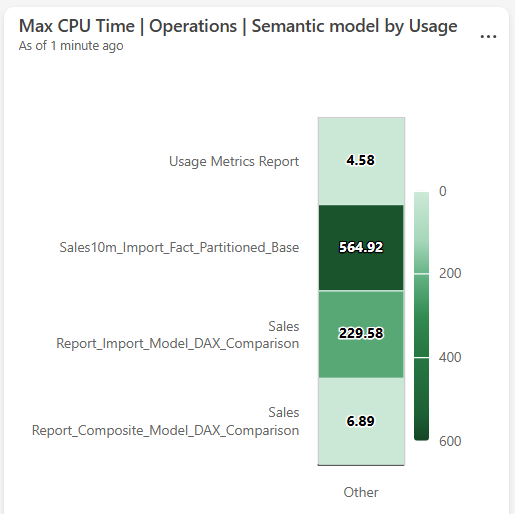 |
| **Line chart** | A chart that connects data points with a continuous line along a numeric or time axis. | Track how a metric changes over time or across an ordered sequence, such as latency trends. | 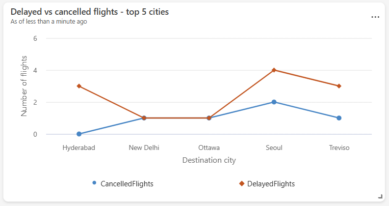 |
| **Map** | A visual that plots data points on a geographic map by location. | Visualize the geographic distribution of events or resources, such as device locations. | 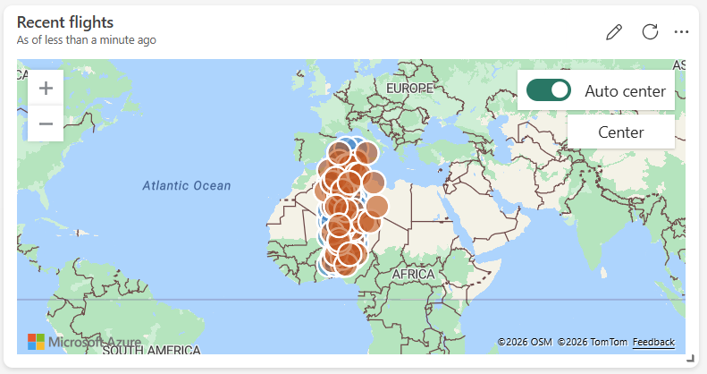 |
| **Markdown** | A tile that renders formatted text and images using Markdown syntax. | Add titles, descriptions, instructions, or embedded images to provide context on a dashboard. | 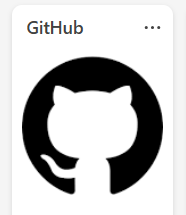 |
| **Multi stat** | A grid of single-value tiles, each showing a key metric. | Display several key metrics side by side at a glance, such as total users and active sessions. | 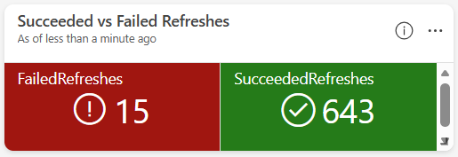 |
| **Pie chart** | A circular chart divided into slices, each representing a category's proportion of the whole. | Show the relative distribution of categories, such as traffic share by device type. | 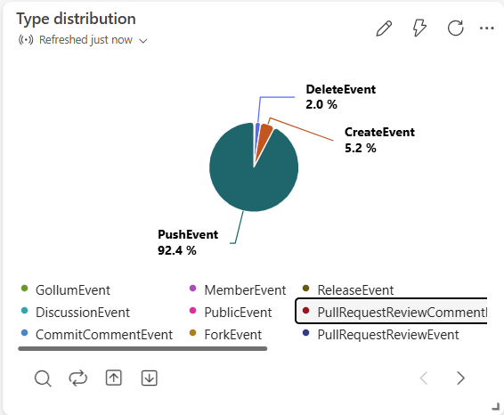 |
| **Scatter chart** | A chart that plots individual data points against two numeric axes. | Explore the correlation between two metrics, such as latency versus load. | 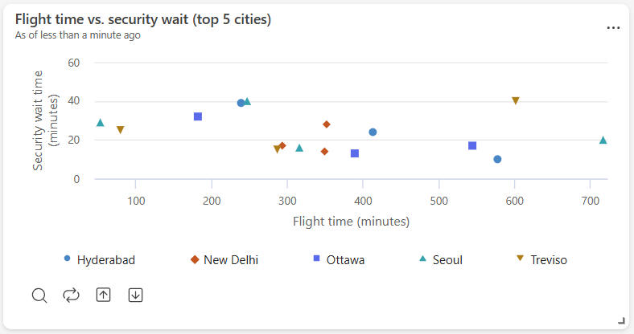 |
| **Stat** | A tile that displays a single numeric value. | Highlight one key metric prominently, such as total revenue. | 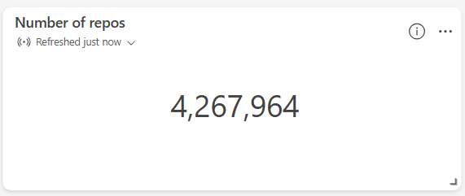 |
| **Table** | A grid that displays rows and columns of data. | Review detailed or raw records, such as the most recent transactions. | 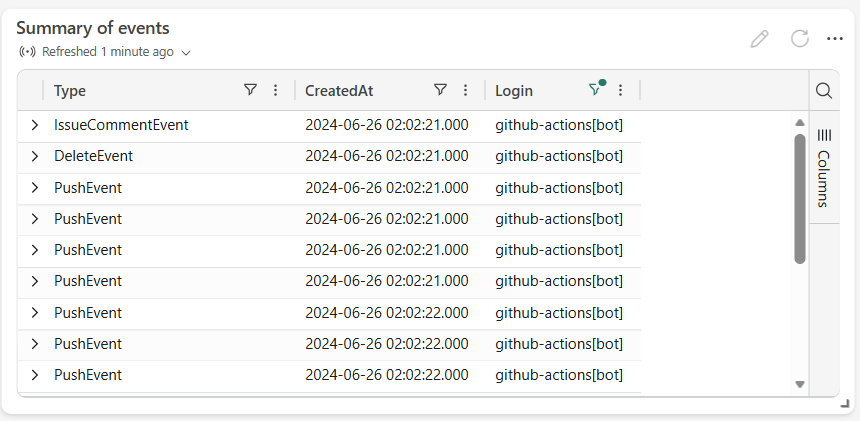 |
| **Time chart** | A line chart with time plotted on the x-axis. | Monitor how a metric evolves over time, such as CPU usage. | 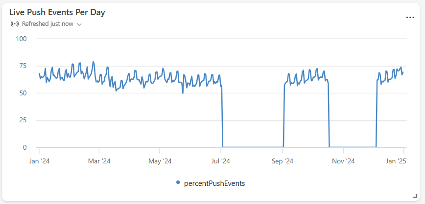 |
| **[Time series chart (preview)](dashboard-visuals-customize.md#time-series-visual-preview)** | A chart that plots multiple time-based measures and categories, with interactive drill-down. | Monitor several related time series together and drill into specific entities or time ranges. | 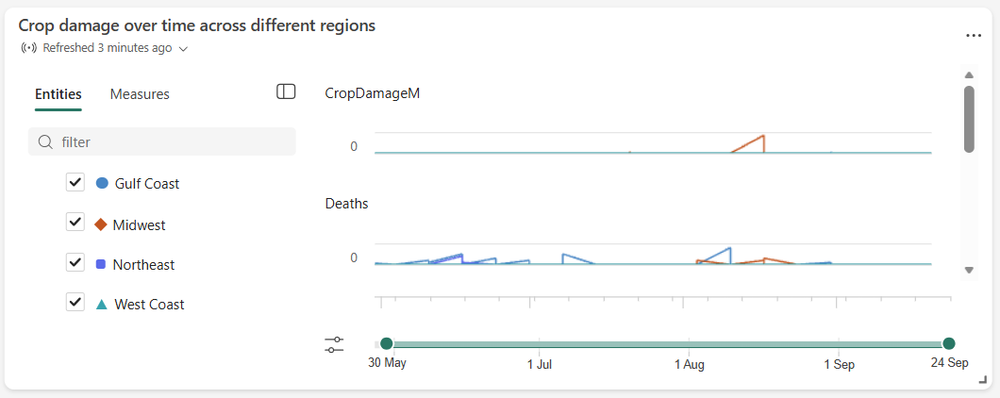 |

## Get started

To create a dashboard, start with one of these options:

1. [Manually create a dashboard](dashboard-real-time-create.md):
    * Set up the Real-Time Dashboard step by step.
    * Manually select and configure data sources.
    * Write Kusto Query Language (KQL) queries to retrieve and visualize data in dashboard tiles, or use Copilot directly in the tile editor to author or modify queries with natural language.
    * Design and organize the layout of your dashboard.

1. [Use Copilot to generate a dashboard](../fundamentals/copilot-generate-dashboard.md).
    * Select a data source, use natural language prompts, and Copilot automatically generates a Real-Time Dashboard as a starting point.
    * Customize the generated dashboard by modifying queries, adding or removing tiles, and adjusting the layout to fit your needs.

## Next steps

After you set up your dashboard and understand the basics, explore these resources to get more value from Real-Time Dashboard:

* [Explore data in Real-Time Dashboard](dashboard-explore-data.md)
* [Customize dashboard visuals](dashboard-visuals-customize.md)
* [Set alerts for Real-Time Dashboard](data-activator/activator-get-data-real-time-dashboard.md)