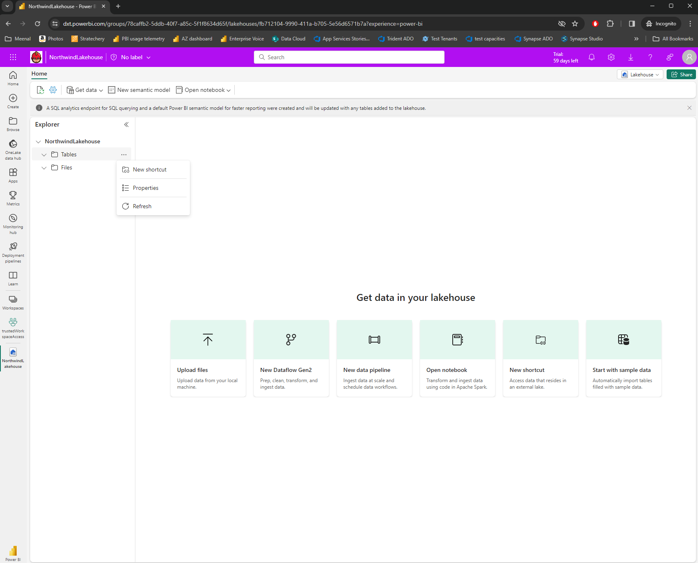
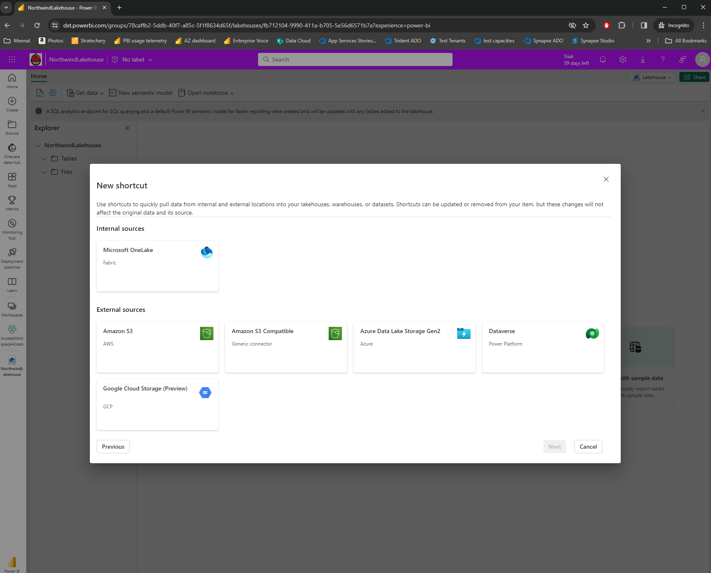
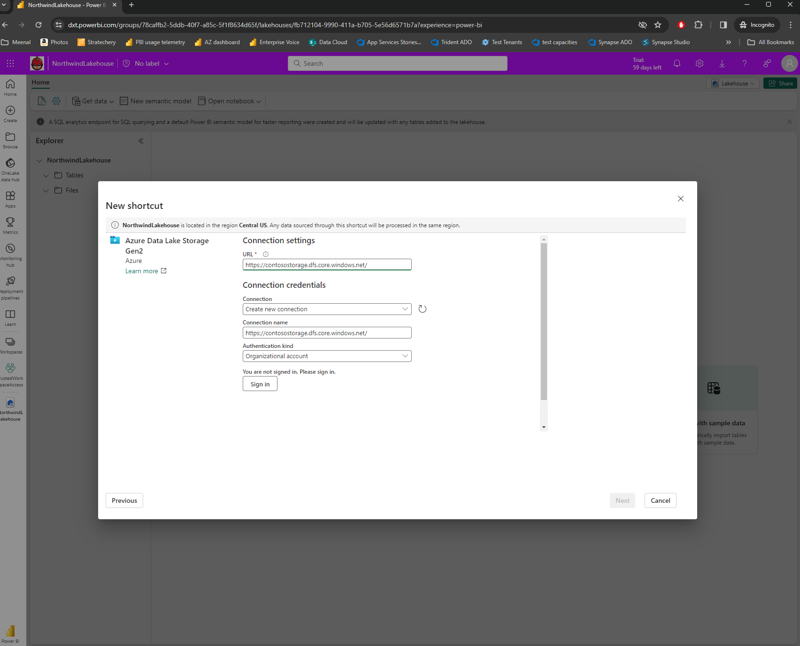
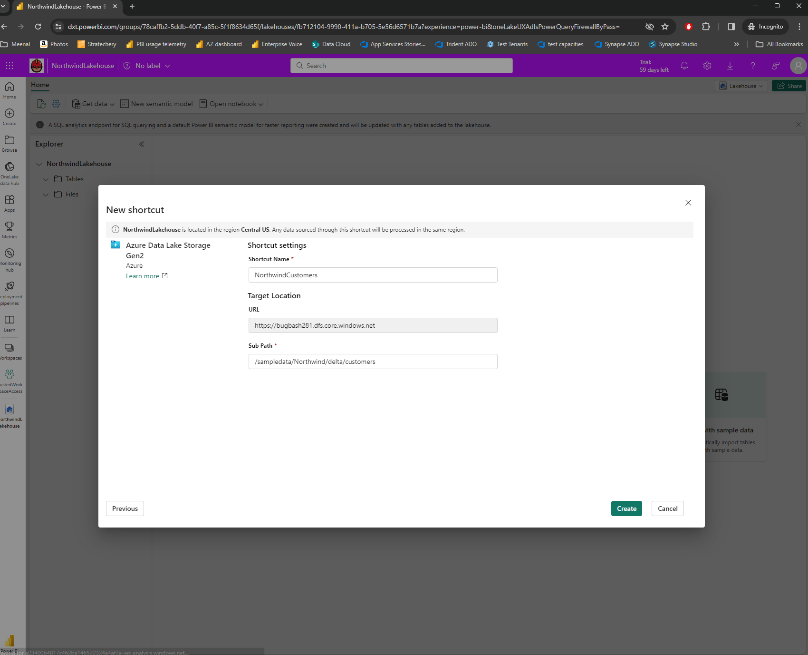
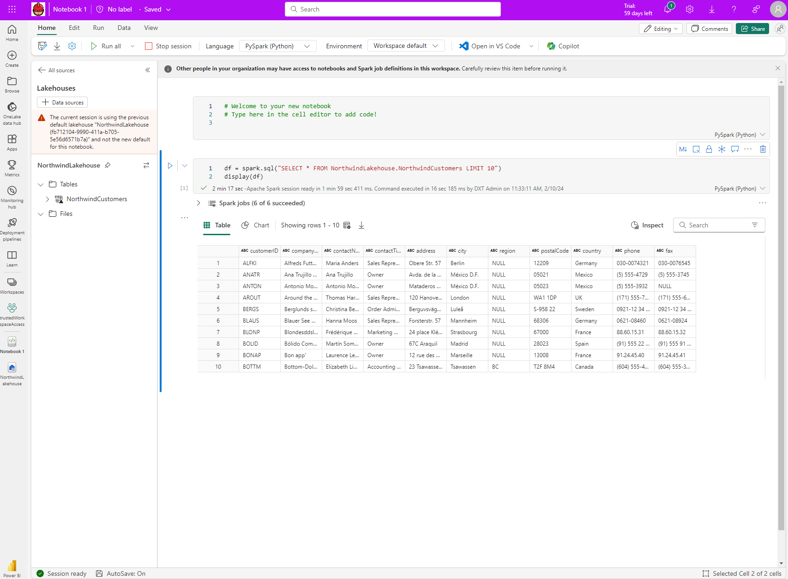
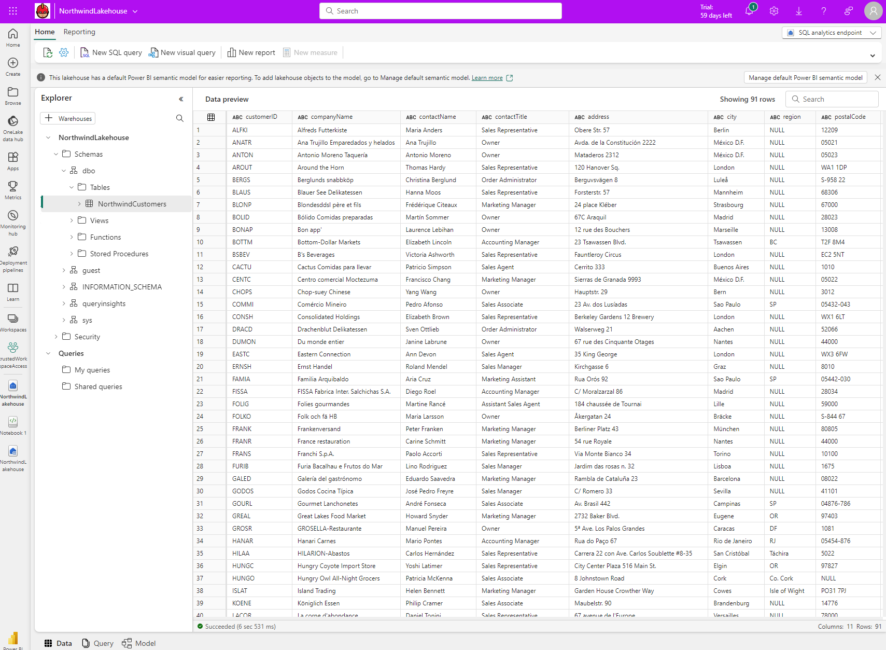
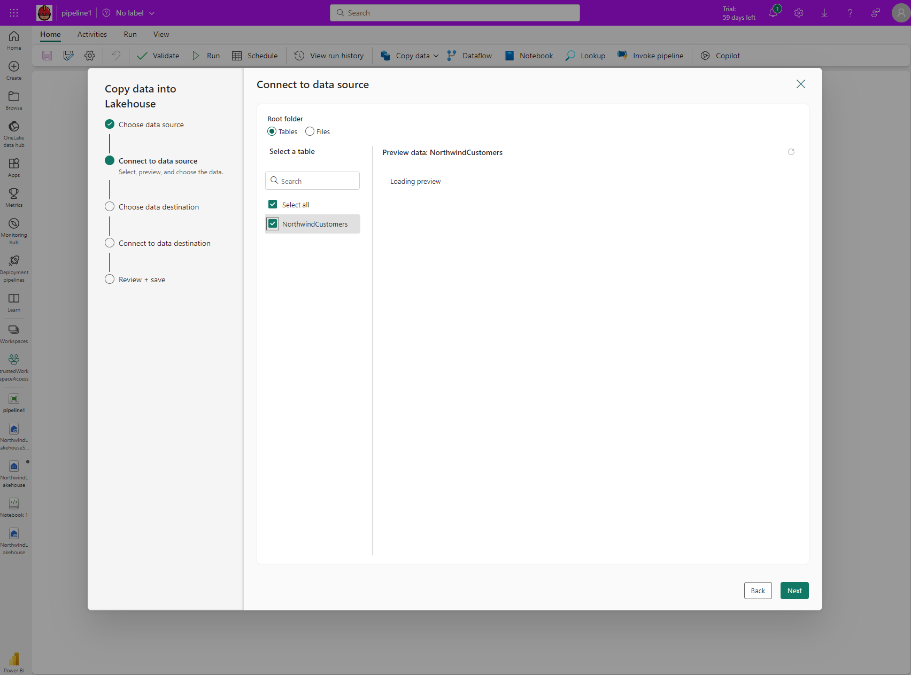
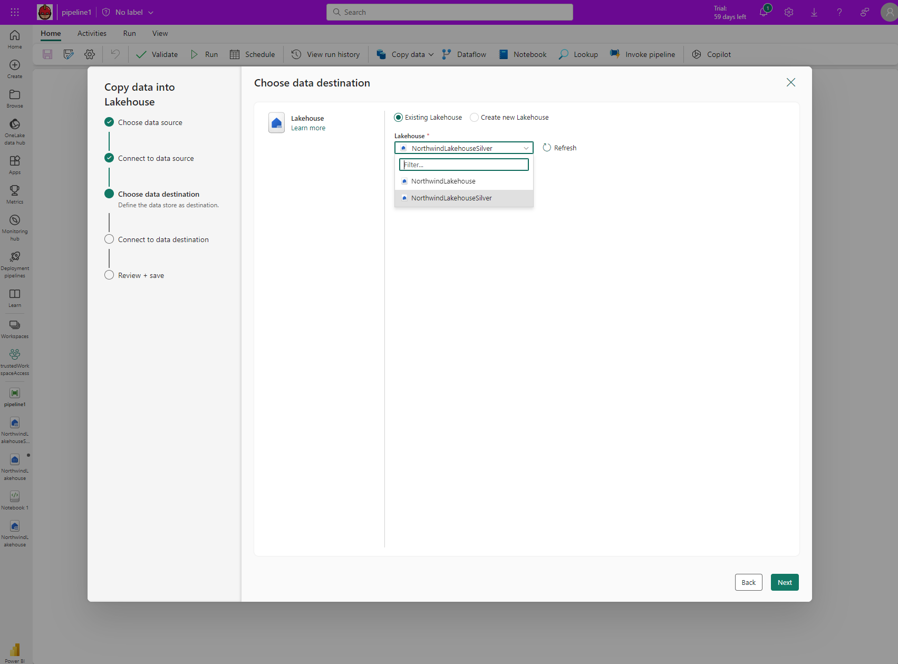
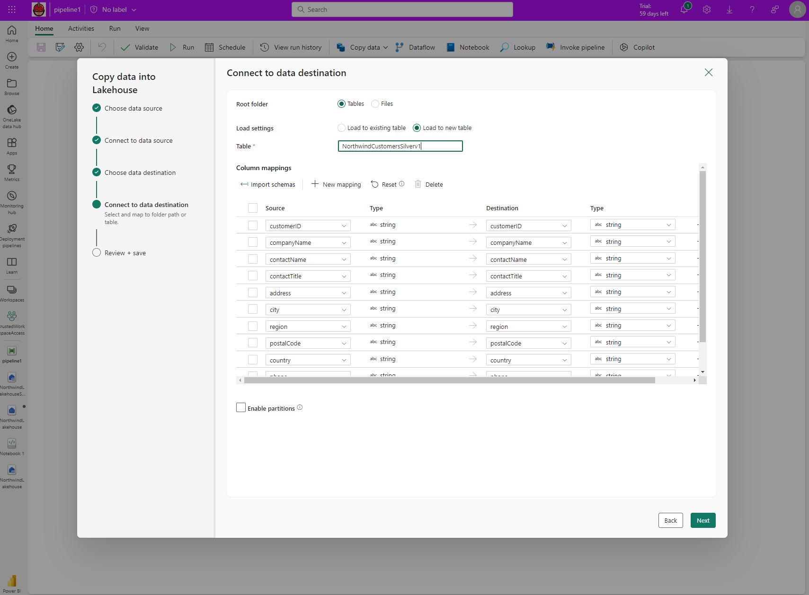
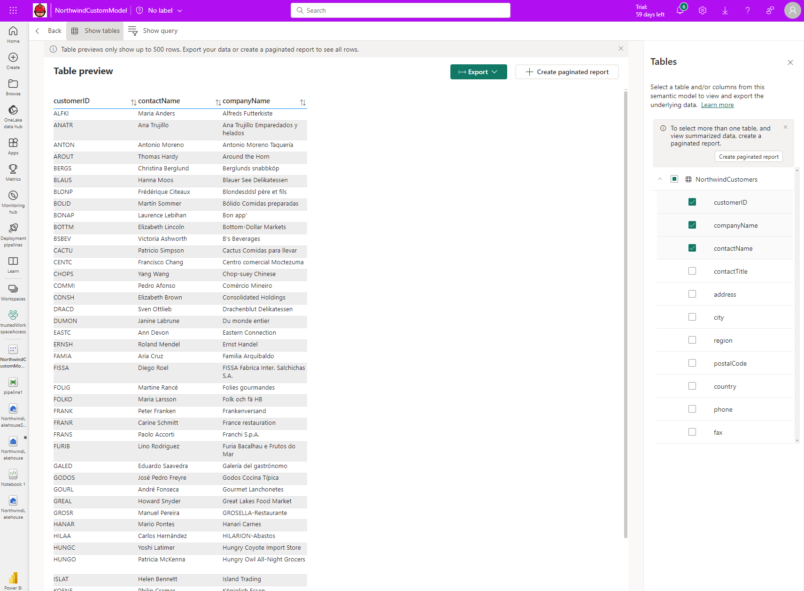

# Trusted workspace access

Fabric allows you to access firewall-enabled Azure Data Lake Gen 2 accounts in a secure manner. Fabric workspaces that have a workspace identity can securely access Azure Data Lake Gen 2 accounts with public network access enabled from selected virtual networks and IP addresses. You can limit ADLS gen 2 access to specific Fabric workspaces.

Fabric workspaces that access a storage account with trusted workspace access need proper authorization for the request. Authorization is supported with Microsoft Entra credentials for organizational accounts or service principals. To find out more about resource instance rules, see [Grant access from Azure resource instances](/azure/storage/common/storage-network-security?tabs=azure-portal).

To limit and protect access to firewall-enabled storage accounts from certain Fabric workspaces, you can set up resource instance rule to allow access from specific Fabric workspaces.

> [!NOTE]
> Trusted workspace access is currently in Public preview. Fabric workspace identity can only be created in workspaces associated with a Fabric capacity (F64 or higher). For information about buying a Fabric subscription, see [Buy a Microsoft Fabric subscription](../enterprise/buy-subscription).

## Configure trusted workspace access in ADLS gen 2

### Resource Instance Rule

You can configure specific Fabric workspaces to access your storage account based on their workspace identity. You can create a resource instance rule by deploying an ARM template with a resource instance rule. To create a resource instance rule:

1. Sign in to the Azure portal and go to **Custom deployment**.

1. Choose **Build your own template in the editor**

1. Create the resource instance rule in the editor. When done, choose **Review + Create**.

1. On the **Basics** tab that appears, specify the required project and instance details. When done, choose **Review + Create**.

1. On the **Review + Create** tab that appears, review the summary and then select **Create**. The rule will be submitted for deployment.

1. When deployment is complete, you'll be able to go to the resource.

>[!NOTE]
>Resource instance rules for Fabric workspaces can only be created through ARM templates. Creation through the Azure portal is not supported.

:::image type="content" source="./media/security-trusted-workspace-access/resource-instance-rule.png" alt-text="Screenshot showing configured resource instance rule." lightbox="./media/security-trusted-workspace-access/resource-instance-rule.png":::

Here is an example of a resource instance rule that can be created through ARM template:

```
"resourceAccessRules": [

       { "tenantId": " df96360b-9e69-4951-92da-f418a97a85eb",

          "resourceId": "/subscriptions/00000000-0000-0000-0000-000000000000/resourcegroups/Fabric/providers/Microsoft.Fabric/workspaces/ b2788a72-eef5-4258-a609-9b1c3e454624”}]
```

A complete ARM template is provided at the end of this document.

### Trusted service exception

If you select the trusted service exception for a Azure Data Lake Gen 2 account which has public network access enabled from selected virtual networks and IP addresses, Fabric workspaces with a workspace identity will be able to access the storage account. When the trusted service exception checkbox is selected, any workspaces in your tenant's Fabric capacities that have a workspace identity can access data stored in the storage account.

This configuration is not recommended, and support may be discontinued in the future. We recommend that you [use resource instance rules to grant access to specific resources](/azure/storage/common/storage-network-security?tabs=azure-portal).

### Who can configure Storage accounts for trusted service access.

The storage account owner (an Azure RBAC role) can configure resource instance rules or trusted service exception.

 ## How to use trusted workspace access in Fabric

### Create a OneLake shortcut to Storage account with trusted workspace access

 With the workspace identity configured in Fabric and trusted access enabled in your ADLS Gen2 storage account, you can create OneLake shortcuts to access your data from fabric. You just create a new ADLS shortcut in a Fabric Lakehouse and start analyzing your data with Spark, SQL, and Power BI.

#### Pre-requisites

* A Fabric workspace associated with a Fabric capacity. See [Workspace identity](../get-started/workspace-identity.md).
* Create the workspace identity associated with the Fabric workspace.
* The user account or service principal used for creating the shortcut should have Azure RBAC roles on the storage account. The principal must have a Storage Blob Data Contributor, Storage Blob Data owner, or Storage Blob Data Reader role at the storage account scope, or a Storage Blob Delegator role at the storage account scope in addition to a Storage Blob Data Reader role at the container scope.
* Configure a resource instance rule for the storage account.

Steps

1. Start by creating a new shortcut in a Lakehouse.



2. Select External sources -> Azure Data Lake Storage Gen 2



3. Provide the URL of the storage account that has been configured with trusted workspace access. Select *Organizational account*, or *Service Principal* as the authentication method.



4. Provide the shortcut name and sub path and select **Create**.



5. The lakehouse shortcut is created, and you should be able to preview storage data in the shortcut.

### Use the OneLake shortcut to a storage account with trusted workspace access in Fabric items

With OneCopy in Fabric, you can access your OneLake shortcuts with trusted access from all Fabric workloads.

#### Spark

You can use Spark to access data from your OneLake shortcuts. When shortcuts are used in Spark, they appear as folders in OneLake. You just need to reference the folder name to access the data.

You can use the OneLake shortcut to Storage account with trusted workspace access in Spark notebooks.

> [!NOTE]
> When OneLake shortcuts with trusted workspace access are referenced in Spark custom code, the trusted token of the storage account is not available to custom code.



#### SQL endpoint

 Shortcuts created in the "Tables" section of your lakehouse are also available in the SQL endpoint.  You can open the SQL endpoint and query your data just like any other table.



#### 


#### Pipelines

Data pipelines can access managed shortcuts to storage accounts with trusted workspace access. Data pipelines can be used to read from or write to storage accounts through OneLake shortcuts. In this example, the pipeline reads data from a lakehouse containing a OneLake shortcut and writes it to another lakehouse in the same Fabric workspace.




#### 



#### 




#### 


#### Dataflows v2

Dataflows v2 can be used to access managed shortcuts to storage accounts with trusted workspace access. Dataflows v2 can read from or write to storage accounts through OneLake shortcuts.

#### Semantic models and reports

Default semantic model associated with a Lakehouse SQL endpoint can read managed shortcuts to storage accounts with trusted workspace access. To see the managed tables in the default semantic model, go to the SQL endpoint -> Reporting -> Automatically update semantic model.

You can also create new semantic models that reference table shortcuts to storage accounts with trusted workspace access. Go to the SQL endpoint, select **Reporting** and choose **New semantic model**.

You can create reports on top of the default semantic models and custom semantic models.


#### 


#### 




#### KQL Database

You can also create OneLake shortcuts to Azure Data Lake Storage Gen 2 in a KQL database. The steps to create the managed shortcut with trusted workspace access remain the same.

### Restrictions and Considerations

* Trusted workspace access is only supported for workspaces in Fabric capacities (F64 or higher).
* If a workspace with a workspace identity is migrated to a non-Fabric capacities or Fabric capacity less than F64, trusted workspace access might stop working after an hour. In case of SQL endpoints with managed shortcuts to storage accounts, the shortcuts may stop working after ninety minutes, or when the SQL endpoint cache is refreshed on demand.
* Pre-existing shortcuts created before October 10<sup>th</sup>, 2023 don't support trusted workspace access.
* Connections for trusted workspace access can't be created or modified in **Manage connections and gateways**.
* If you reuse connections that support trusted workspace access in Fabric items other than shortcuts, or in other workspaces, they might not work.
* Only the organizational account or service principal must be used for authentication to storage accounts for trusted workspace access.
* Pipelines can't write to OneLake table shortcuts on storage accounts with trusted workspace access. This is a temporary limitation.
* A maximum of 200 resource instance rules. For more information, see [Azure subscription limits and quotas - Azure Resource Manager | Microsoft Learn](/azure/azure-resource-manager/management/azure-subscription-service-limits)
* If a resource instance rule for a Fabric workspace is removed, trusted workspace access may stop working after an hour. In the case of SQL endpoints with managed shortcuts to storage accounts, the shortcuts might stop working after ninety minutes, or when the SQL endpoint cache is refreshed on demand.
* Resource instance rules for Fabric workspaces can only be created through ARM templates. Creation through the UI isn't supported.

### ARM template sample

```
{
    "$schema": "https://schema.management.azure.com/schemas/2019-04-01/deploymentTemplate.json#",
    "contentVersion": "1.0.0.0",
    "resources": [
        {
            "type": "Microsoft.Storage/storageAccounts",
            "apiVersion": "2023-01-01",
            "name": "<storage account name>",
            "id": "/subscriptions/<subscription id of storage account>/resourceGroups/<resource group name>/providers/Microsoft.Storage/storageAccounts/<storage account name>",
            "location": "<region>",
            "sku": {
                "name": "Standard_RAGRS",
                "tier": "Standard"
            },
            "kind": "StorageV2",
            "properties": {
                "networkAcls": {
                    "resourceAccessRules": [
                        {
                            "tenantId": "<tenantid>",
                            "resourceId": "/subscriptions/00000000-0000-0000-0000-000000000000/resourcegroups/Fabric/providers/Microsoft.Fabric/workspaces/<workspace-id>"
                        }]
                }
            }
        }
    ]
}
```

## Related content

* [Workspace identity](../get-started/workspace-identity.md)
* [Grant access from Azure resource instances](/azure/storage/common/storage-network-security?tabs=azure-portal#grant-access-from-azure-resource-instances)
* [Trusted access based on a managed identity](/azure/storage/common/storage-network-security?tabs=azure-portal#trusted-access-based-on-a-managed-identity)